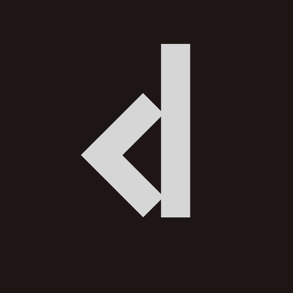

<p align="center">
  
</p>

# Clyde Editor

An open-source animation editor built on the [Rive](https://rive.app) open-source
engine ([rive-runtime](https://github.com/rive-app/rive-runtime)) and Flutter.

The app renders artboards with the GPU-accelerated **Rive Renderer** via the
[`rive_native`](https://pub.dev/packages/rive_native) package and layers an
editing UI (hierarchy, viewport, timeline) on top.

## Status

Early but functional. Currently supported:

- Open `.riv` files (a demo file is bundled) and save edited copies
- Browse artboards and their animations in the hierarchy panel
- Render the active artboard with the GPU Rive Renderer
- Timeline with play/pause, looping, scrubbing, and frame/second display
- Keyframe tracks with drag-to-retime editing and undo
- Inspector showing animated property values at the playhead

Planned:

- Keyframe value editing and cubic curve editing
- Object inspector editing (transform, fill, stroke properties)
- Shape/pen tools for authoring vector content
- Creating new animations and artboards from scratch

## Architecture

```
lib/
  main.dart                     # Entry point, engine init
  src/
    app.dart                    # Root MaterialApp
    core/theme/                 # Design tokens + ThemeData (EditorTheme)
    engine/                     # RiveEngine facade over rive_native
    features/editor/
      editor_screen.dart        # Screen layout composition
      state/                    # EditorState (ChangeNotifier), EditorDocument
      painting/                 # Custom Rive painters (timeline playback)
      widgets/                  # Panels: toolbar, hierarchy, viewport, timeline
```

Design rules:

- **UI never talks to `rive_native` directly.** It goes through
  `EditorState` / `EditorDocument` / `RiveEngine` so the engine dependency
  stays swappable and testable.
- **`EditorState` is the single source of truth**, exposed as a
  `ChangeNotifier`. Panels are dumb views.
- **Painters own frame-by-frame playback.** `TimelineAnimationPainter`
  extends the runtime's `BasicArtboardPainter` and gives the editor full
  control of animation time (play, pause, scrub, loop).

## Getting started

Requirements: Flutter 3.32+ with desktop support enabled.

```sh
flutter pub get
flutter run -d macos    # or: -d windows / -d linux
```

All three desktop platforms (macOS, Windows, Linux) are scaffolded and
built in CI. Linux needs the usual Flutter desktop packages:
`ninja-build libgtk-3-dev clang cmake pkg-config`.

## Keyboard shortcuts

See [SHORTCUTS.md](SHORTCUTS.md).

## Contributing

See [CONTRIBUTING.md](CONTRIBUTING.md). Issues and PRs are welcome.

## License

MIT. See [LICENSE](LICENSE).

The Rive runtime and renderer are licensed separately by Rive under the
MIT license, see the [rive-runtime](https://github.com/rive-app/rive-runtime)
repository.
